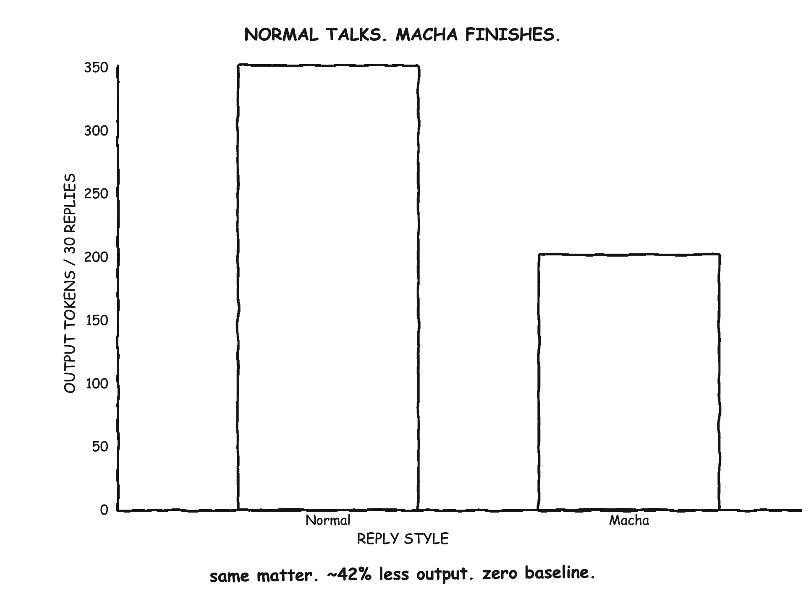

# Macha

<p align="center">
  
</p>

<p align="center">
  <a href="https://skills.sh/kingroryg/macha/macha"></a>
</p>

An opt-in response style for AI coding assistants: compact, natural, Tamil-influenced South Indian English. Macha shortens the assistant's replies—not your prompts, files, code, commands, or tool output.

## Install

Every Agent Skills-compatible assistant:

```bash
npx skills add kingroryg/macha --skill macha --agent '*' --global --yes
```

Native installers:

```bash
# Claude Code
claude plugin marketplace add kingroryg/macha
claude plugin install macha@macha

# Gemini CLI
gemini extensions install https://github.com/kingroryg/macha
```

## Use

Send `/macha on` to turn it on. Send `/macha off` to turn it off.

## How it sounds

These are replies the model may compose—not transformations of the user's words.

| Intent | Possible Macha replies |
|---|---|
| Ask | `What'll you do?` · `Why like this?` · `Now what?` · `What to do?` · `Check this?` · `Thoughts?` |
| Check | `Done ah?` · `Tests passed?` · `Release ready ah?` · `Regression ah?` · `Both green ah?` |
| Confirm | `Same bug, no?` · `Correct ah?` · `Possible ah?` · `Same ah?` · `You want patch?` |
| Request | `Just move this.` · `Just check once.` · `Tell.` · `One sec.` |
| Act | `Done already.` · `Will do now.` · `Will check.` · `Can manage.` · `Leave it.` · `Coming.` |
| Assess | `No need.` · `Not possible.` · `No tension.` · `No chance.` |
| React | `Seri.` · `Aiyo.` · `Paavam.` · `Super.` · `Saama.` · `Mass.` · `Dai.` |
| Everyday | `Prepone the meeting.` · `Just timepass.` · `Paapom.` · `Appadiya?` · `Kandippa.` · `Vera level.` |
| Cinema garnish | `Building strong; basement weak.` · `Enna koduma idhu?` · `Vada poche.` · `Why blood? Same blood.` |
| More cinema | `Aaniye pudunga vendam.` · `Plan panni pannanum.` · `Aahaan.` · `Magizhchi.` |

Film references are garnish: at most one per reply, only when casual and low-stakes. They never replace the result, warning, uncertainty, or next action.

`Paavam.` means a sympathetic “poor thing” or “that's unfortunate,” never mockery or dismissal.

Macha keeps negation, conditions, numbers, units, code, commands, paths, URLs, identifiers, citations, quotes, and exact errors intact. Security warnings, destructive actions, serious topics, and formal artifacts stay in clear standard prose.

## Stats

Thirty paired coding-assistant replies expressing the same intent used about **42% fewer output tokens** in Macha:

<p align="center">
  
</p>

| Measure | Normal | Macha | Reduction |
|---|---:|---:|---:|
| `o200k_base` tokens | 351 | 201 | **42.7%** |
| `cl100k_base` tokens | 352 | 203 | **42.3%** |
| Words | 313 | 127 | **59.4%** |

This is an output-only, authored-pair benchmark—not a live-model A/B evaluation. The [corpus](benchmarks/output-pairs.json) excludes input, tool output, code, and skill-loading cost. The skill itself is 983–996 tokens and hosts may resend it each turn, so short or already-terse sessions can be net-negative.

```bash
python3 -m pip install -r requirements-benchmark.txt
npm run benchmark
npm run audit:phrases
```

For the live normal-vs-terse-vs-Macha harness and evidence rules, see [benchmarks](benchmarks/README.md).

## Development

```bash
npm test
python3 /path/to/skill-creator/scripts/quick_validate.py skills/macha
```

`skills/macha/SKILL.md` is the single source of behavior.
